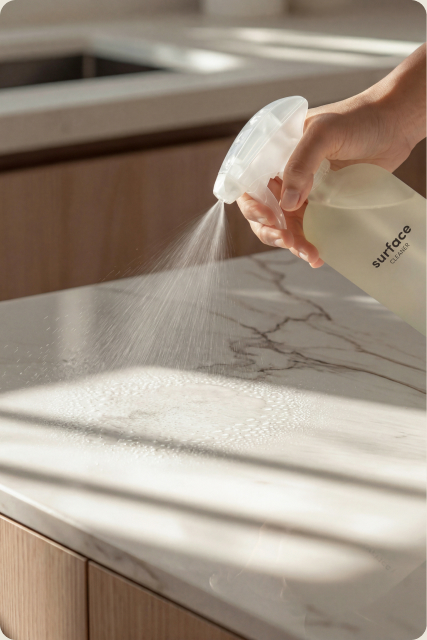

# Implementation prompt — scroll-scrubbed film section ("Days of Protection")

Hand this to an agent verbatim. It is written to be self-contained.

---

## Task

Implement a full-bleed, scroll-scrubbed video section. As the visitor scrolls through a pinned
section, a short film advances **frame by frame in lockstep with scroll position** (it does not
play — its `currentTime` is driven by scroll). A three-step timeline along the bottom fills with
brand colour as the scroll passes each step.

## Where

| Thing | Path |
|---|---|
| Page | `everneat-services/index.html` — single self-contained HTML file, all CSS in one `<style>` in `<head>`, all JS in one `<script>` before `</body>` |
| Section anchor | `<section class="protect" id="protection">` |
| CSS block | under the `/* ---------- days of protection ---------- */` comment |
| JS block | inside the existing IIFE, under the `// #9 — days of protection` comment |
| Video asset | `everneat-services/assets/protect-tech.mp4` |
| Poster image | `everneat-services/assets/protect.jpg` |

There is no build step, no bundler, no framework, no package.json for this page. Vanilla HTML/CSS/JS
only. Do not add dependencies.

### Design tokens already defined in `:root` — use these, do not hardcode

```
--lime:#C8FF00;  --lime-deep:#AADC00;
--ink:#1f1d18;   --ink2:#57524a;   --muted:#8b867a;
--cream:#eae6db; --edge:clamp(20px,5vw,64px); --pad:clamp(72px,9vw,120px);
--serif: (editorial serif, used italic for headings)
```

---

## The asset — encode for SEEKING, not playback

This is the single biggest determinant of whether the effect feels smooth, and it is not a code
concern. Arbitrary seeking costs *frames-from-the-nearest-keyframe*. A default ~2s GOP means every
scroll step decodes a long run and the scrub stutters no matter how good the JS is.

```bash
ffmpeg -i SOURCE.mp4 -t 12.4 -an \
  -vf "unsharp=5:5:0.9:5:5:0.0" \
  -c:v libx264 -crf 23 -g 8 -pix_fmt yuv420p -movflags +faststart \
  everneat-services/assets/protect-tech.mp4
```

- `-g 8` — keyframe every 8 frames, so any seek decodes at most 7. **Non-negotiable.**
- `-an` — no audio; it is never played.
- `+faststart` — moov atom first.
- `unsharp` — counters upscaling softness when a sub-1080p master is shown full-bleed. Measured
  +25% edge energy for +0.47MB. Skip if the master is already ≥ the rendered device width.
- `-t` — **trim any dark fade-out.** A dark tail wrecks contrast for anything overlaid on the
  film, and makes the section fade to black at the end of the scroll. Check with:
  `ffmpeg -ss T -i clip.mp4 -frames:v 1 -vf "scale=64:36,format=gray" -f rawvideo - | od -An -tu1`

Do **not** pre-upscale to 1920 to reduce browser scaling: measured *identical* edge energy to
sharpening at native resolution, for +4MB. There is no real detail to recover.

---

## Markup

```html
<section class="protect" id="protection">
  <div class="protect-stage">
    <div class="phase-scene">
      
    </div>
    <div class="protect-veil"></div>
    <div class="protect-copy">
      <h2 class="sec-title">Days of protection</h2>
      <p class="sec-intro">…</p>
    </div>
    <div class="prot-bar">
      <div class="prot-step"><strong>0H · Purify</strong><p>…</p></div>
      <div class="prot-step"><strong>24–48H · Protect</strong><p>…</p></div>
      <div class="prot-step"><strong>72H+ · Maintain</strong><p>…</p></div>
    </div>
  </div>
</section>
```

The `<video>` is **created by JS**, never authored in HTML — mobile and reduced-motion must never
fetch a 6MB clip they will not use.

---

## CSS

```css
.protect{background:var(--cream);padding:var(--pad) 0}

.protect-stage{position:relative;overflow:hidden;background:#d7d2c6;
  min-height:clamp(420px,70vh,640px)}
.phase-scene{position:absolute;inset:0}
.phase-scene>img,.phase-scene>video{position:absolute;inset:0;
  width:100%;height:100%;object-fit:cover;object-position:center 45%}

.protect-veil{position:absolute;inset:0;pointer-events:none;
  background:radial-gradient(ellipse 34% 38% at 17% 20%,
    rgba(255,255,255,.94) 0%,rgba(255,255,255,.9) 38%,
    rgba(255,255,255,.6) 66%,rgba(255,255,255,.2) 85%,rgba(255,255,255,0) 100%)}

.protect-copy{position:absolute;top:0;left:0;right:0;z-index:2;
  padding:clamp(28px,4.5vw,64px) var(--edge) 0}
.protect-copy .sec-title,.protect-copy .sec-intro{
  text-shadow:0 1px 2px rgba(255,255,255,.9),0 0 16px rgba(255,255,255,.95),
              0 0 38px rgba(255,255,255,.7)}
.protect-copy .sec-intro{max-width:460px}

.phase-scene>video{opacity:0;transition:opacity .5s ease}
.phase-scene>img{transition:opacity .5s ease}
.phase-scene.has-clip>video{opacity:1}
.phase-scene.has-clip>img{opacity:0}

.prot-bar{position:absolute;left:0;right:0;bottom:0;z-index:2;
  display:grid;grid-template-columns:repeat(3,1fr);
  background:transparent;border-top:1px solid rgba(31,29,24,.14)}
.prot-step{padding:clamp(16px,1.7vw,24px) clamp(18px,2vw,30px);
  border-right:1px solid rgba(31,29,24,.14);min-width:0;
  background:rgba(255,255,255,.66)}
.prot-step:last-child{border-right:none}
.prot-step.on{background:var(--lime)}
.prot-step strong{display:block;font-family:var(--serif);font-style:italic;font-weight:400;
  font-size:clamp(16px,1.3vw,19px);line-height:1.2;color:var(--ink);
  font-variant-numeric:tabular-nums;margin-bottom:7px}
.prot-step p{margin:0;font-size:clamp(13.5px,1.02vw,15.5px);line-height:1.45;color:var(--ink)}
.prot-bar::after{content:"";position:absolute;top:-1px;left:0;height:3px;
  width:calc(var(--p,0) * 100%);background:var(--ink)}

@media (prefers-reduced-motion:no-preference){
  .protect{height:280vh;padding:0}
  .protect-stage{position:sticky;top:80px;height:calc(100vh - 80px);min-height:0}
  .prot-step{transition:background-color .45s ease}
  .prot-step strong,.prot-step p{transition:color .4s ease}
}
@media (prefers-reduced-motion:reduce){ .prot-bar::after{width:100%} }

@media (max-width:900px){
  .protect{height:auto;padding:var(--pad) 0}
  .protect-stage{position:relative;top:auto;height:auto;
    min-height:clamp(420px,70vh,640px);
    display:flex;flex-direction:column;justify-content:flex-end}
  .protect-veil{width:100%;background:linear-gradient(180deg,rgba(255,255,255,.95) 0%,
    rgba(255,255,255,.9) 24%,rgba(255,255,255,.5) 44%,rgba(255,255,255,0) 62%)}
  .protect-copy .sec-intro{max-width:none}
  .prot-bar{position:relative;grid-template-columns:1fr;background:transparent}
  .prot-bar::after{width:100%}
  .prot-step{border-right:none;border-top:1px solid rgba(31,29,24,.14)}
  .prot-step:first-child{border-top:none}
}
@media (max-width:760px){ .prot-step p{font-size:13.5px} }
```

---

## JS

Inside an IIFE that early-returns on `prefers-reduced-motion: reduce`.

```js
var protectEl=document.querySelector('.protect');
if(protectEl){
  var pSteps=[].slice.call(protectEl.querySelectorAll('.prot-step'));
  var pScene=protectEl.querySelector('.phase-scene');
  var pVid=null,pAsked=false,pTarget=0,pCur=0,pTick=false;
  var pScrub=window.matchMedia('(min-width:901px)').matches&&
             window.matchMedia('(prefers-reduced-motion:no-preference)').matches;

  function loadProtectClip(){
    pAsked=true;
    fetch('assets/protect-tech.mp4').then(function(r){
      if(!r.ok)throw new Error(r.status);
      return r.blob();
    }).then(function(b){
      var v=document.createElement('video');
      v.muted=true;v.playsInline=true;v.preload='auto';
      v.setAttribute('muted','');v.setAttribute('playsinline','');
      v.addEventListener('loadeddata',function(){pScene.classList.add('has-clip');},{once:true});
      v.src=URL.createObjectURL(b);
      pScene.appendChild(v);
      pVid=v;
    }).catch(function(){});   // missing clip -> poster stays, section still reads
  }

  function updateProtect(){
    pTick=false;
    var r=protectEl.getBoundingClientRect();
    var total=r.height-window.innerHeight;
    pTarget=total>0?Math.min(1,Math.max(0,-r.top/total)):1;
    var step=pTarget>=0.62?2:pTarget>=0.30?1:0;
    pSteps.forEach(function(s,i){s.classList.toggle('on',i<=step);});
    if(pScrub)protectEl.style.setProperty('--p',pTarget.toFixed(4));
    if(pScrub&&!pAsked&&r.top<window.innerHeight*1.5&&r.bottom>0)loadProtectClip();
  }

  function scrubProtect(){
    if(pVid&&pVid.duration&&!pVid.seeking){
      pCur+=(pTarget-pCur)*0.18;
      var t=Math.min(pCur,0.999)*pVid.duration;
      if(Math.abs(pVid.currentTime-t)>0.008){try{pVid.currentTime=t;}catch(e){}}
    }
    requestAnimationFrame(scrubProtect);
  }

  window.addEventListener('scroll',function(){
    if(!pTick){pTick=true;requestAnimationFrame(updateProtect);}
  },{passive:true});
  updateProtect();
  if(pScrub)requestAnimationFrame(scrubProtect);
}
```

### Why each non-obvious line exists

Technique adapted from [`oso95/scroll-world`](https://github.com/oso95/scroll-world)'s
`scrub-engine.js` (MIT, © 2026 cyw). The constants `0.18` and `0.008` are theirs.

- **blob `src`** — seeking works without server byte-range support.
- **rAF lerp toward the target** — this *is* the smoothness. Assigning `currentTime` directly from
  the scroll handler stutters.
- **skip while `video.seeking`** — a fast flick otherwise piles up seeks and freezes the decoder.
- **`Math.min(pCur,0.999)`** — never seek exactly to `duration`.
- **`loadeddata` → `has-clip`** — swap off the poster only once a real frame has decoded.
- **`.catch(function(){})`** — a missing/404 clip degrades to the poster; the section still reads.

Do **not** mount scroll-world's engine itself. It is a fixed-position full-page takeover with its
own nav, copy layer and progress bar, and would fight an existing page.

---

## Rules that are load-bearing (each one is a bug already paid for)

1. **`.phase-scene > img, video` must be `position:absolute`.** Both are `100%×100%`; in normal flow
   the poster fills the box and the video lays out *after* it, landing below the stage where
   `overflow:hidden` clips it. Symptom: section renders as an empty box, no console error.
2. **Never encode step state as `opacity` on text over video.** The original bar dimmed to
   `opacity:.28` over a translucent lime surface and measured **1.26:1** — not "dimmed", unrendered.
   Encode state as *surface colour*. Every state must be legible on its own; the active state may
   only add emphasis, never supply legibility.
3. **Lime cannot be both the surface and the signal.** An all-lime bar makes every step look
   reached. Inactive = translucent white, active = solid lime.
4. **Width-scope anything that undoes the pin.** The `prefers-reduced-motion:no-preference` block has
   no width bound; if it sets a property the ≤900px block does not restate, a gap opens where an
   absolutely-positioned bar sits over an unpinned poster.
5. **`position:relative`, not `static`, when undoing the sticky pin.** `.phase-scene`/veil/copy are
   absolute and will escape to the viewport otherwise.
6. **`aspect-ratio` + a definite `height` makes width derive from height.** Setting both on
   `.phase-scene` pushed it 413px wide inside a 386px viewport.
7. **Nowrap labels in a fixed grid column silently overlap** the adjacent cell. Measure the widest
   label's ink width; do not guess.
8. **Thresholds `0.30/0.62`, not `0.45/0.9`.** The old values gave the final step — the one carrying
   the commercial call to action — the last 10% of the pin.

---

## Verification — do not skip, and do not trust screenshots alone

Headless Chrome **does not composite `<video>` layers** into `Page.captureScreenshot`, even with
swiftshader. A blank film area in a headless screenshot proves nothing. Verify in **headed** Chrome
over CDP, or the paint bug in rule 1 will look like a harness limitation for hours.

Further harness traps, all of which produce convincing false results:

- Programmatic `window.scrollTo` from an automation context **fires no `scroll` event**. Use real
  wheel input, or dispatch/force frames.
- `requestAnimationFrame` is **paused in an occluded or hidden window**, so rAF-queued state updates
  never run and every sample reads the initial state. Force a frame (a screenshot does it) before
  reading. A capture taken immediately after scrolling shows the *previous* state.
- Chrome **stalls media loading in hidden tabs**: `readyState 0`, `networkState 2`, events
  `loadstart → stalled`, and **no error**. Check `document.visibilityState` first.
- Disable the network cache (`Network.setCacheDisabled`) when re-testing a re-encoded asset, or you
  will measure the old file and get suspiciously identical numbers.

### What to assert

- `video.readyState === 4`, correct `duration`, `has-clip` applied
- `currentTime` tracks scroll within ~10ms at 0 / 25 / 50 / 75 / 100% of the pin
- step classes progress `100 → 110 → 111`
- screenshots carry real frame content (blank ≈44KB vs ~120–155KB with footage at 1440×900)
- **contrast measured from rendered pixels, not estimated**: hide the type, screenshot, sample the
  surface behind each text row per x-slice, linearise sRGB, score against the real type colours —
  at both the **brightest and darkest** frames of the clip. Body text needs 4.5:1, large text 3:1.
- responsive at 320 / 390 / 430 / 768 / 1440: no horizontal page scroll, no clipped copy, pin
  disabled and no clip fetched below 900px

Current measured floors, for regression comparison:

| | mean | worst-5% |
|---|---|---|
| Heading | 12.8–14.0:1 | 11.0:1 |
| Standfirst | 6.7–6.9:1 | 5.6:1 |
| Active step (solid lime) | 11.0:1 | 11.0:1 (frame-independent) |
| Inactive step (translucent) | 9.7–14.1:1 | 8.2:1 |

---

## Known limits

- **Full-bleed forces `cover`, so the film crops.** A 1.78:1 clip in a ~2.2:1 stage loses ~19% of
  frame height. `object-position:center 45%` chooses what is lost.
- **Sharpness is capped by the master.** 1320×740 rendered at ~1463 CSS px is ~2.2× on a 2× display.
  Sharpening helps; only a higher-resolution master actually fixes it.
- **The poster should be a frame from the film.** A different image causes a visible jump when the
  clip decodes.
- **No video below 900px** by design. Phones show the poster. If motion is wanted there, use a muted
  autoplay loop — not a scrub; mobile decoders handle scroll-seeking badly.
